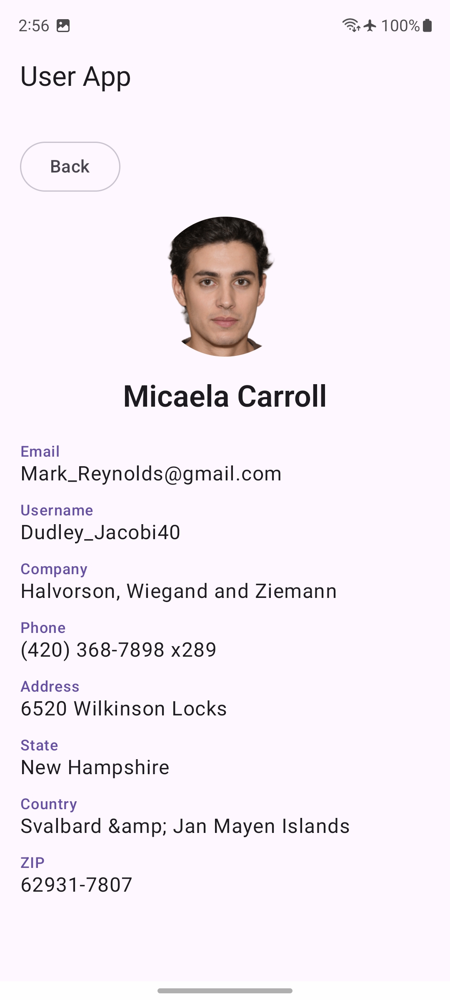
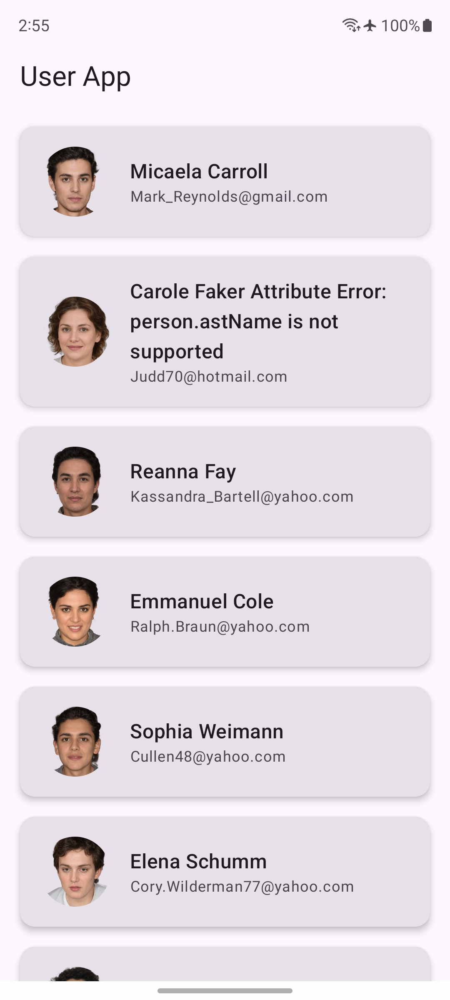

# UserANZ

An Android app that fetches and displays a list of users from a remote API with a detail view for each user.

## Architecture

Clean Architecture with multi-module structure and MVVM pattern.

```
app/          → Entry point, navigation
core/model/   → Shared domain models
data/user/    → API, DTOs, mappers, repository
domain/user/  → Repository interface, use cases
feature/
  userlist/   → User list screen & ViewModel
  userdetails/→ User detail screen
```

## Tech Stack

| Category | Library |
|---|---|
| Language | Kotlin 2.2.10 |
| UI | Jetpack Compose + Material 3 |
| DI | Hilt 2.56.2 |
| Networking | Retrofit 2.11.0 + OkHttp 4.12.0 |
| Image Loading | Coil 2.7.0 |
| Async | Kotlin Coroutines + Flow |
| Navigation | Navigation Compose 2.9.0 |
| Testing | JUnit 4, Mockito, coroutines-test |

## Assumptions & Decisions

- **Details screen reuses the list ViewModel** to avoid an extra network call
- **Pagination is scaffolded** (`page` param in use case/repository) but not yet wired to the UI
- **No offline caching** — data is fetched fresh each session
- **No search/filter** — all users from the API are displayed as-is

## Media

### Screenshots




### Demo Video

[Watch recording](app/media/videos/Recording.mp4)

## Potential Improvements

- Pagination with Paging 3
- Offline support with Room
- Search and filter on the list screen
- Pull-to-refresh

## Getting Started

```bash
./gradlew assembleDebug   # build
./gradlew test            # unit tests
```

**Author:** shivaprasad-bhat · May 14, 2026
